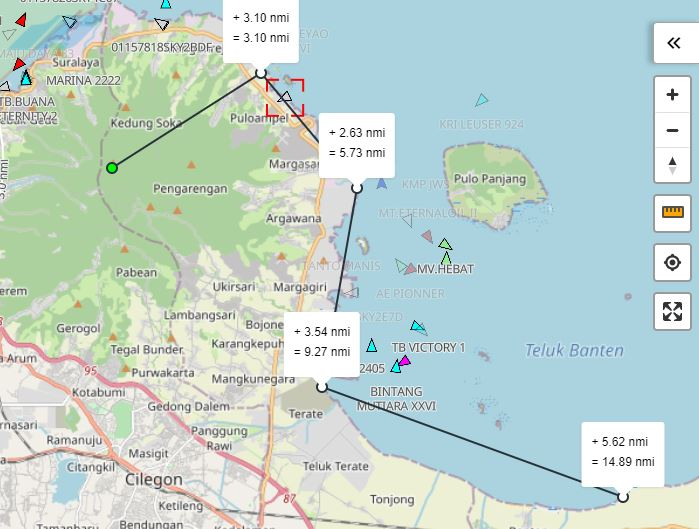

# mapbox-gl-ruler-control



## Install

```javascript
npm install mapbox-gl-ruler-control

```

## Usage

```javascript
...
import MapboxGl from 'mapbox-gl'
import RulerControl from 'mapbox-gl-ruler-control'
...
const map = new MapboxGl.Map({ ... })
const ruler = new RulerControl(options)
map.addControl(ruler, 'top-right')
...
```

## Options

- **units**: km (kilometer), mi (mile), nmi (nautical mile). Defaults to km
- **font**: font used for label. Must be one of those fonts loaded by the map
- **fontSize**: font size, defaults to 12
- **mainColor**: color used to paint lines and marker's border. Default: #000
- **secondaryColor**: color used as markers background. Defaults to #fff
- **altColor**: color used as the background of the first marker ever created. Defaults to #0f0
